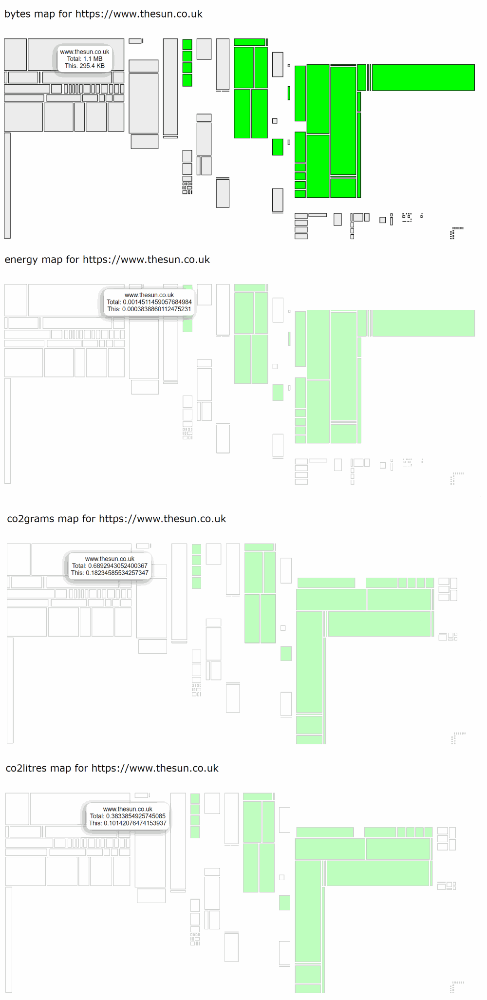

# greentree
Treemap to identify CO2 and energy usage a web page via a WebPageTest result

Using a WebPageTest result, the GreenWebFoundation API, and calculations from Carbon Website, display a treemap visualisation, per host of:

1. Bytes per request
2. Energy used serving each request (Watt Hours)
3. CO2 generated for each request (grams and also litres)

The blocks are grey if the host uses non-renewable energy and green if it uses a renewable energy source.

## Client Side

https://rposbo.github.io/greentree

There's a single page with all the logic inside; just paste in a WPT test ID and hit **GO!** The dots and dashes are calls to GreenWebFoundation API to see if the host is using renewable energy; **dashes** are when the call failed (probably blocked by the browser thinking it's an advert ping).

Here is an [example greentree treemap for The Sun website, generated *in your browser* from a WebPageTest result](https://rposbo.github.io/greentree/index.html?testId=191205_8X_d8c9b58ef93545be9df8c371e1b4dc46) - it can take a while to load, so the result is below:

## Server Side

The rest of the repo is the nodejs version of this, so you can hook it into a pipeline and generate static reports if you wanted to.

Here is an [example greentree treemap for The Sun website using data already generated on the server from a WebPageTest result](https://rposbo.github.io/greentree/server-demo.html).
